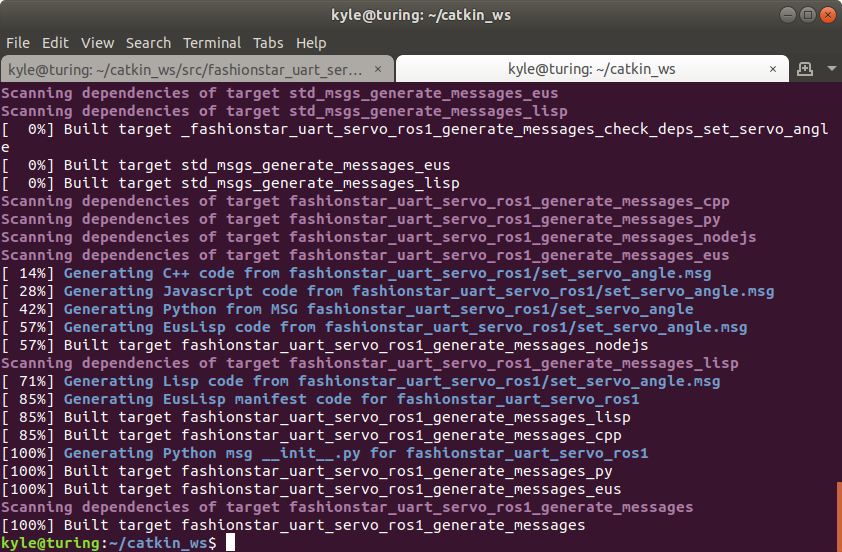
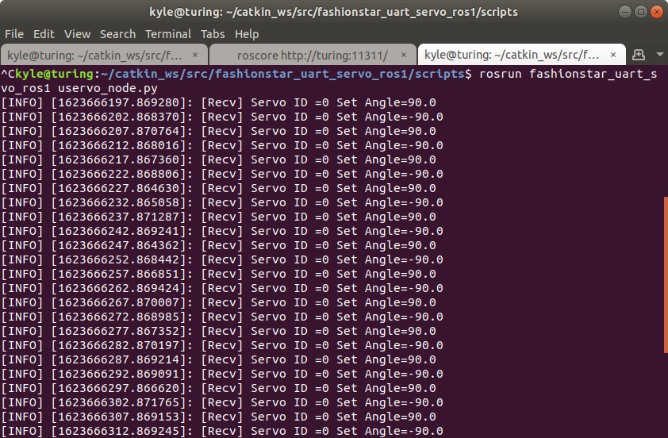
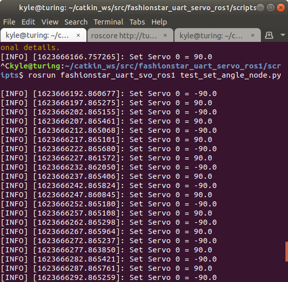

# 通过ROS的Message控制舵机角度(Python)


[toc]

\- 作者: 阿凯爱玩机器人

\- Email: kyle.xing@fashionstar.com.hk

\- 更新时间: 2021-06-13

## 创建包

[ROS Wiki - Creating a ROS Package](http://wiki.ros.org/ROS/Tutorials/CreatingPackage)

进入文件夹

```bash
cd ~/catkin_ws/src
```

创建包

```bash
catkin_create_pkg fashionstar_uart_servo_ros1 std_msgs rospy roscpp
```


## 创建Message

官方文档参考:  [ROS wiki - msg](http://wiki.ros.org/msg)


### 创建文件夹

`msg` 文件夹， 放置Message

### 创建Message文件

标准信息格式支持如下

- int8，int16，int32，int64
- float32，float64
- string
- 其他自定义msg：package/MessageName
- 不定长array[ ]以及定长array[N]


创建一个自己的Message格式

`SetServoAngle.msg`

```cmake
uint8 id
float32 angle
```


### 配置`pakcage.xml`

添加如下两行:

构建的时候生成message的依赖

```xml
<build_depend>message_generation</build_depend>
```

运行的时候message依赖.

```xml
<exec_depend>message_runtime</exec_depend>
```


### 配置`CMakeLists.txt`


配置`find_package`

```cmake
## Find catkin macros and libraries
## if COMPONENTS list like find_package(catkin REQUIRED COMPONENTS xyz)
## is used, also find other catkin packages
find_package(catkin REQUIRED COMPONENTS
  roscpp
  rospy
  std_msgs
  message_generation # Message生成依赖
)
```


注册`.msg` 文件

```cmake
## Generate messages in the 'msg' folder
## 这里添加msg文件夹下的msg文件名称
add_message_files(
  FILES
  SetServoAngle.msg
)
```

添加生成message的时候需要的依赖

```cmake
## Generate added messages and services with any dependencies listed here
generate_messages(
  DEPENDENCIES
  std_msgs
)
```

配置catkin, `CATKIN_DEPENDS` 里面添加`message_runtime`

```cmake
###################################
## catkin specific configuration ##
###################################
## The catkin_package macro generates cmake config files for your package
## Declare things to be passed to dependent projects
## INCLUDE_DIRS: uncomment this if your package contains header files
## LIBRARIES: libraries you create in this project that dependent projects also need
## CATKIN_DEPENDS: catkin_packages dependent projects also need
## DEPENDS: system dependencies of this project that dependent projects also need
catkin_package(
  INCLUDE_DIRS include
  LIBRARIES fashionstar_uart_servo_ros1
  CATKIN_DEPENDS message_runtime roscpp rospy std_msgs
  DEPENDS system_lib
)
```

### 构建Message

```bash
cd ~/catkin_ws
catkin_make
```




### 使用rosmsg查看创建的msg

指令格式

```bash
rosmsg show <message文件的名称>
```

示例: 

```bash
kyle@turing:~/catkin_ws$ rosmsg show SetServoAngle
[fashionstar_uart_servo_ros1/SetServoAngle]:
uint8 id
float32 angle

```


## Python节点-消息接收者

工程文件里面，创建Python脚本的文件夹`scripts`

将Python2版本的`uservo.py`拷贝到`scripts` 文件夹里面. 

并创建一个串口总线Servo的Python节点 `uservo_demo_node.py`

赋予其执行权限

```bash
sudo chmod +x uservo_demo_node.py 
```

`uservo_demo_node.py ` 

```python
#!/usr/bin/env python
#coding:utf-8
'''
舵机控制节点
'''
import rospy
import serial
from fashionstar_uart_servo_ros1.msg import SetServoAngle

def set_servo_angle_callback(data):
    '''回调函数-设置舵机角度'''
    rospy.loginfo("[Recv] Servo ID ={} Set Angle={}".format(data.id, data.angle))
    
def uart_manager():    
    # 初始化节点
    rospy.init_node('uservo_node', anonymous=True)
    # 舵机角度订阅者
    rospy.Subscriber("set_servo_angle", SetServoAngle, set_servo_angle_callback)
    # 持续等待， 直到节点结束
    rospy.spin()

if __name__ == '__main__':
    uart_manager()
```

注意: **文件头必须有如下声明**

```python
#!/usr/bin/env python
#coding:utf-8
```

否则运行的时候会遇到报错

```
kyle@turing:~/catkin_ws$ rosrun fashionstar_uart_servo_ros1 uservo_demo_node.py
import-im6.q16: not authorized `rospy' @ error/constitute.c/WriteImage/1037.
from: can't read /var/mail/fashionstar_uart_servo_ros1.msg
/home/kyle/catkin_ws/src/fashionstar_uart_servo_ros1/scripts/uservo_node.py: line 6: syntax error near unexpected token `('
/home/kyle/catkin_ws/src/fashionstar_uart_servo_ros1/scripts/uservo_node.py: line 6: `def set_servo_angle_callback(data):'

```


## Python节点-消息发送者


创建另外一个文件`test_set_angle_node.py` 并赋予其可执行权限

```bash
 chmod +x test_set_angle_node.py
```

`test_set_angle_node.py`

```python
#!/usr/bin/env python
#coding:utf-8
'''
电机角度控制测试节点
'''
import rospy
from fashionstar_uart_servo_ros1.msg import SetServoAngle

SERVO_ID = 0 # 测试的电机ID

def test_set_servo_angle():
    '''回调函数'''
    # 创建节点
    rospy.init_node('test_set_angle_node', anonymous=True) 
    # 创建发布者 
    # - Topic名称为:  'set_servo_angle'
    # - Message格式类型: set_servo_angle
    # - queue_size 消息队列尺寸，自定义
    pub = rospy.Publisher('set_servo_angle', SetServoAngle, queue_size=2)
    # 设置发送节拍 0.2HZ 
    rate = rospy.Rate(0.2)
    # 电机角度
    angle = 90.0
    # 创建信息对象 
    msg = SetServoAngle()

    while not rospy.is_shutdown():
        # 修改电机角度
        angle *= -1.0
        # 填充Message
        msg.id = SERVO_ID
        msg.angle = angle
        rospy.loginfo('Set Servo {} = {}'.format(msg.id, msg.angle))
        pub.publish(msg)
        rate.sleep()

if __name__ == '__main__':
    test_set_servo_angle()

```


## 运行例程

运行Master节点

```bash
roscore
```

运行舵机服务节点(接收者)

```
rosrun fashionstar_uart_svo_ros1 uservo_demo_node.py
```




运行舵机角度控制测试节点(发送者)

```bash
rosrun fashionstar_uart_svo_ros1 test_set_angle_node.py
```




## 让舵机真的动起来

修改`uservo_node.py`文件. 导入FashionStar 舵机Python2的SDK，驱动舵机转动起来.

你可以根据自己的需求定制角度控制的具体的参数，例如指定时间/功率/转速等等， 具体的API请参阅舵机Python SDK的使用手册。

```python
#!/usr/bin/env python
#coding:utf-8
'''
舵机控制节点
'''
import rospy
import serial
from uservo import UartServoManager
from fashionstar_uart_servo_ros1.msg import SetServoAngle

# 参数配置
# 角度定义
SERVO_PORT_NAME =  u'/dev/ttyUSB0'		# 舵机串口号 <<< 修改为实际串口号
SERVO_BAUDRATE = 115200			        # 舵机的波特率
SERVO_ID = 0					        # 舵机的ID号
SERVO_HAS_MTURN_FUNC = False	        # 舵机是否拥有多圈模式

# 初始化串口
uart = serial.Serial(port=SERVO_PORT_NAME, baudrate=SERVO_BAUDRATE,\
					 parity=serial.PARITY_NONE, stopbits=1,\
					 bytesize=8,timeout=0)
# 初始化舵机管理器
uservo = UartServoManager(uart)

def set_servo_angle_callback(data):
    '''回调函数-设置舵机角度'''
    rospy.loginfo("[Recv] Servo ID ={} Set Angle={}".format(data.id, data.angle))
    uservo.set_servo_angle(data.id, data.angle, interval=0)

def uart_manager():    
    # 初始化节点
    rospy.init_node('uservo_node', anonymous=True)
    # 舵机角度订阅者
    rospy.Subscriber("set_servo_angle", SetServoAngle, set_servo_angle_callback)
    # 持续等待， 直到节点结束
    rospy.spin()

if __name__ == '__main__':
    uart_manager()
```


