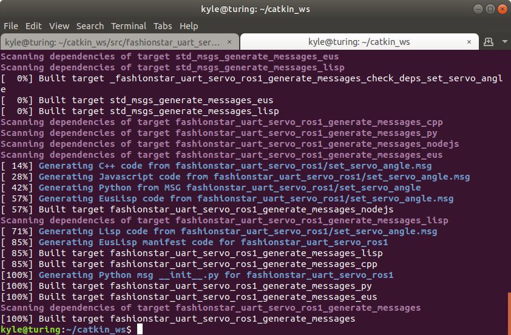

# 通过ROS的Message控制舵机角度(C++)


[toc]

\- 作者: 阿凯爱玩机器人

\- Email: kyle.xing@fashionstar.com.hk

\- 更新时间: 2021-06-16


## 安装依赖

需要在Ubuntu上安装[FashionStar串口总线舵机 C++ SDK](https://github.com/servodevelop/fashionstar-uart-servo-cpp)

参见教程: 

* [FashionStar串口总线舵机库-使用说明(Ubuntu)](https://github.com/servodevelop/fashionstar-uart-servo-cpp/blob/master/doc/2.FashionStar%E4%B8%B2%E5%8F%A3%E6%80%BB%E7%BA%BF%E8%88%B5%E6%9C%BA%E5%BA%93-%E4%BD%BF%E7%94%A8%E8%AF%B4%E6%98%8E(Ubuntu)/FashionStar%E4%B8%B2%E5%8F%A3%E6%80%BB%E7%BA%BF%E8%88%B5%E6%9C%BA%E5%BA%93-%E4%BD%BF%E7%94%A8%E8%AF%B4%E6%98%8E(Ubuntu).md)
* [串口总线舵机SDK使用手册(C++)](https://github.com/servodevelop/fashionstar-uart-servo-cpp/blob/master/doc/3.%E4%B8%B2%E5%8F%A3%E6%80%BB%E7%BA%BF%E8%88%B5%E6%9C%BASDK%E4%BD%BF%E7%94%A8%E6%89%8B%E5%86%8C(C++)/%E4%B8%B2%E5%8F%A3%E6%80%BB%E7%BA%BF%E8%88%B5%E6%9C%BASDK%E4%BD%BF%E7%94%A8%E6%89%8B%E5%86%8C(C++).md)


## 创建包

[ROS Wiki - Creating a ROS Package](http://wiki.ros.org/ROS/Tutorials/CreatingPackage)

进入文件夹

```bash
cd ~/catkin_ws/src
```

创建包

```bash
catkin_create_pkg fashionstar_uart_servo_ros1 std_msgs rospy roscpp
```


## 创建Message

官方文档参考:  [ROS wiki - msg](http://wiki.ros.org/msg)


### 创建文件夹

`msg` 文件夹， 放置Message

### 创建Message文件

标准信息格式支持如下

- int8，int16，int32，int64
- float32，float64
- string
- 其他自定义msg：package/MessageName
- 不定长array[ ]以及定长array[N]


创建一个自己的Message格式

`SetServoAngle.msg`

```cmake
uint8 id
float32 angle
```


### 配置`pakcage.xml`

添加如下两行:

构建的时候生成message的依赖

```xml
<build_depend>message_generation</build_depend>
```

运行的时候message依赖.

```xml
<exec_depend>message_runtime</exec_depend>
```


### 配置`CMakeLists.txt`


配置`find_package`

```cmake
## Find catkin macros and libraries
## if COMPONENTS list like find_package(catkin REQUIRED COMPONENTS xyz)
## is used, also find other catkin packages
find_package(catkin REQUIRED COMPONENTS
  roscpp
  rospy
  std_msgs
  message_generation # Message生成依赖
)
```


注册`.msg` 文件

```cmake
## Generate messages in the 'msg' folder
## 这里添加msg文件夹下的msg文件名称
add_message_files(
  FILES
  SetServoAngle.msg
)
```

添加生成message的时候需要的依赖

```cmake
## Generate added messages and services with any dependencies listed here
generate_messages(
  DEPENDENCIES
  std_msgs
)
```

配置catkin, `CATKIN_DEPENDS` 里面添加`message_runtime`

```cmake
###################################
## catkin specific configuration ##
###################################
## The catkin_package macro generates cmake config files for your package
## Declare things to be passed to dependent projects
## INCLUDE_DIRS: uncomment this if your package contains header files
## LIBRARIES: libraries you create in this project that dependent projects also need
## CATKIN_DEPENDS: catkin_packages dependent projects also need
## DEPENDS: system dependencies of this project that dependent projects also need
catkin_package(
  INCLUDE_DIRS include
  LIBRARIES fashionstar_uart_servo_ros1
  CATKIN_DEPENDS message_runtime roscpp rospy std_msgs
  DEPENDS system_lib
)
```

### 构建Message

```bash
cd ~/catkin_ws
catkin_make
```




### 使用rosmsg查看创建的msg

指令格式

```bash
rosmsg show <message文件的名称>
```

示例: 

```bash
kyle@turing:~/catkin_ws$ rosmsg show SetServoAngle
[fashionstar_uart_servo_ros1/SetServoAngle]:
uint8 id
float32 angle

```


## C++节点-消息接收者

在`src`下创建`uservo_demo_node.cpp`

```cpp
/* 
 * 舵机控制节点(Demo) 
 */
// 导入ROS依赖
#include "ros/ros.h"
#include "fashionstar_uart_servo_ros1/SetServoAngle.h"

#include "CSerialPort/SerialPort.h"
#include "FashionStar/UServo/FashionStar_UartServoProtocol.h"
#include "FashionStar/UServo/FashionStar_UartServo.h"

using namespace fsuservo;
using namespace fashionstar_uart_servo_ros1;

// 参数定义
#define SERVO_PORT_NAME "/dev/ttyUSB0" 	// Linux下端口号名称 /dev/ttyUSB{}
#define SERVO_ID 0 				        // 舵机ID号

// 创建协议对象
FSUS_Protocol protocol(SERVO_PORT_NAME, FSUS_DEFAULT_BAUDRATE);
// 创建一个舵机对象
FSUS_Servo servo0(SERVO_ID, &protocol);

/* 舵机角度设置回调函数 */
void set_servo_angle_callback(const SetServoAngle& data){
    ROS_INFO("[RECV] Servo ID = %d Set Angle = %.1f", data.id, data.angle);
    // 设置舵机角度
    servo0.setRawAngle(data.angle, 0);
}


int main(int argc, char **argv)
{
    // 创建节点名称
    ros::init(argc, argv, "uservo_demo_node");
    // 创建NodeHandle
    ros::NodeHandle node_handle;

    // 创建接收者
    ros::Subscriber set_servo_angle_sub = node_handle.subscribe("set_servo_angle", 2, set_servo_angle_callback);

    // 进入循环等待
    ros::spin();
}
```


## C++节点-消息发送者

在`src`下创建`test_query_servo_angle.cpp`

```c++
/* 
 * 测试舵机角度控制节点 
 */

#include "ros/ros.h"
// 自定义消息
#include "fashionstar_uart_servo_ros1/SetServoAngle.h"

using namespace fashionstar_uart_servo_ros1;

#define SERVO_ID 0 				        // 舵机ID号

int main(int argc, char **argv)
{
    // 创建节点名称
    ros::init(argc, argv, "test_set_angle_node");
    // 创建NodeHandle
    ros::NodeHandle node_handle;
    // 创建发布者
    ros::Publisher set_servo_angle_pub = node_handle.advertise<SetServoAngle>("set_servo_angle", 2);
    // 循环频率0.2HZ
    ros::Rate loop_rate(0.2);
    // 创建Message
    SetServoAngle msg;

    float angle = 90.0;
    while(ros::ok()){
        // 修改目标角度
        angle *= -1.0;
        // 构建Message
        msg.id = SERVO_ID;
        msg.angle = angle;
        // 发布消息
        set_servo_angle_pub.publish(msg);
        // 输出日志
        ROS_INFO("Set Servo %d Angle = %.1f", msg.id, msg.angle);
        // 延时等待
        loop_rate.sleep();
    }
}

```


## 配置`CMakeLists.txt`


配置`CMakeLists.txt`

添加include路径， 这样才可以找到依赖库的`.h`文件所在的路径

```makefile
set(CMAKE_INSTALL_PREFIX /usr/local)
include_directories(
# include
  ${catkin_INCLUDE_DIRS}
  ${CMAKE_INSTALL_PREFIX}/include
)

```

设置`link`文件夹， 动态链接库所在的位置. 

```makefile
# 设置串口总线舵机链接库的位置
link_directories(
  ${CMAKE_INSTALL_PREFIX}/lib
)
```

添加可执行程序

```makefile
## Declare a C++ executable
## With catkin_make all packages are built within a single CMake context
## The recommended prefix ensures that target names across packages don't collide
## 定义C++可执行文件
# - 串口总线舵机服务示例节点
add_executable(uservo_demo_node src/uservo_demo_node.cpp)

add_executable(test_set_angle_node src/test_set_angle_node.cpp)
```

动态链接

```makefile
## Specify libraries to link a library or executable target against
target_link_libraries(uservo_demo_node
  ${catkin_LIBRARIES}
  cserialport # 轻量级串口通信库
  fsuartservo # FashionStar串口总线舵机SDK (C++)
)

target_link_libraries(test_set_angle_node
  ${catkin_LIBRARIES}
)
```


完成的`CMakeLists.txt`

```makefile
cmake_minimum_required(VERSION 3.0.2)
project(fashionstar_uart_servo_ros1)

## Compile as C++11, supported in ROS Kinetic and newer
# add_compile_options(-std=c++11)

## Find catkin macros and libraries
## if COMPONENTS list like find_package(catkin REQUIRED COMPONENTS xyz)
## is used, also find other catkin packages
find_package(catkin REQUIRED COMPONENTS
  roscpp
  rospy
  std_msgs
  message_generation # Message生成依赖
)


################################################
## Declare ROS messages, services and actions ##
################################################

## Generate messages in the 'msg' folder
## 这里添加msg文件夹下的msg文件名称
add_message_files(
  FILES
  SetServoAngle.msg     # 设置舵机角度
  SetServoDamping.msg   # 设置舵机为阻尼模式
)

## Generate services in the 'srv' folder
add_service_files(
  FILES
  QueryServoAngle.srv  # 舵机角度查询服务
  
)

## Generate added messages and services with any dependencies listed here
generate_messages(
  DEPENDENCIES
  std_msgs
)


###################################
## catkin specific configuration ##
###################################

catkin_package(
  INCLUDE_DIRS include
  LIBRARIES fashionstar_uart_servo_ros1
  CATKIN_DEPENDS message_runtime roscpp rospy std_msgs
  DEPENDS system_lib
)

###########
## Build ##
###########

## Specify additional locations of header files
## Your package locations should be listed before other locations
set(CMAKE_INSTALL_PREFIX /usr/local)
include_directories(
# include
  ${catkin_INCLUDE_DIRS}
  ${CMAKE_INSTALL_PREFIX}/include
)

# 设置串口总线舵机链接库的位置
link_directories(
  ${CMAKE_INSTALL_PREFIX}/lib
)

## Declare a C++ executable
## With catkin_make all packages are built within a single CMake context
## The recommended prefix ensures that target names across packages don't collide
## 定义C++可执行文件
# - 串口总线舵机服务示例节点
add_executable(uservo_demo_node src/uservo_demo_node.cpp)

add_executable(test_set_angle_node src/test_set_angle_node.cpp)

## Specify libraries to link a library or executable target against
target_link_libraries(uservo_demo_node
  ${catkin_LIBRARIES}
  cserialport # 轻量级串口通信库
  fsuartservo # FashionStar串口总线舵机SDK (C++)
)

target_link_libraries(test_set_angle_node
  ${catkin_LIBRARIES}
)
```


## 运行例程

运行Master节点

```bash
roscore
```

运行舵机服务节点(接收者)

```
rosrun fashionstar_uart_svo_ros1 uservo_demo_node
```

运行舵机角度控制测试节点(发送者)

```bash
rosrun fashionstar_uart_svo_ros1 test_set_angle_node
```


